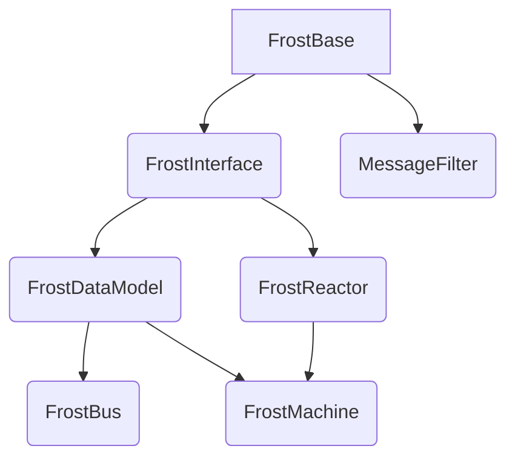

# Introduction to Frost Components

The Frost framework is built upon a set of modular and reusable reactors, each designed to provide specific functionalities for building robust, event-driven systems. These components are organized in an inheritance hierarchy, allowing them to share common functionalities while also providing specialized capabilities. Understanding this hierarchy is key to effectively using and extending the Frost framework.

At the root of the hierarchy is `FrostBase`, which provides common utilities like logging and parameter management. From there, the components branch into more specialized roles.

### Component Inheritance Tree

The following diagram illustrates the inheritance relationships between the core Frost components:

### Core Components Explained

- **`FrostBase`**: The foundational reactor from which all other Frost components inherit. It provides essential utilities for logging, configuration, and message passing.

- **`FrostInterface`**: Extends `FrostBase` to establish the fundamental communication protocol for Frost components. It manages the connection to the `FrostBus` and incorporates a `MessageFilter` to handle incoming messages.

- **`MessageFilter`**: A specialized reactor that processes and routes incoming messages based on their type (e.g., `REQUEST`, `RESPONSE`). It allows reactors to subscribe to specific message types, decoupling message receiving from processing.

- **`FrostDataModel`**: Inherits from `FrostInterface` and integrates a data model into a reactor. It is responsible for loading the data model from a file, handling data-related requests (e.g., method invocations, variable updates), and notifying subscribers of changes.

- **`FrostReactor`**: A base component for Frost actors that need to communicate over the `FrostBus`. It extends `FrostInterface` and provides the logic for a reactor to automatically connect to the bus at startup.

- **`FrostMachine`**: A paramount reactor that inherits from both `FrostDataModel` and `FrostReactor`. It enables the describtion of machines behavior and to link it to the exposed data model nodes.

- **`FrostBus`**: A central message-routing component that manages the registration of all Frost components and ensures that messages are delivered to their intended targets. It acts as message broker among machineries and components involved in the simulation.
