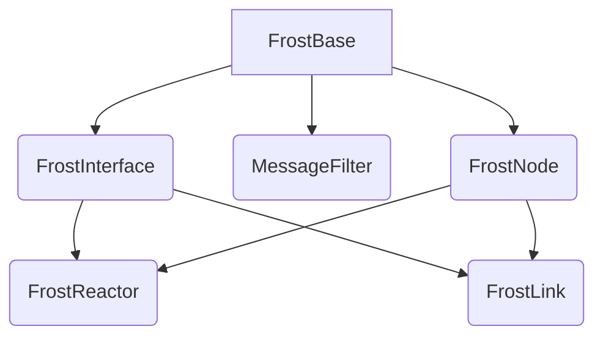

# Components

Frost provides six reactors. Two of them — `FrostReactor` and `FrostLink` — are
the ones you instantiate. The other four exist so that those two can share
their machinery.

`FrostReactor` and `FrostLink` each inherit from two parents: `FrostInterface`,
which gives them channels and message dispatch, and `FrostNode`, which gives
them a data model. Lingua Franca supports multiple inheritance for reactors, so
this is expressed directly as `extends FrostInterface, FrostNode`.

## The six reactors

| Reactor | Contributes | You extend it? |
| --- | --- | --- |
| [`FrostBase`](frost-base.md) | Logging, configuration, port helpers, logical-time helpers | Rarely — only for components that need no messaging |
| [`FrostInterface`](frost-interface.md) | `channel_in` / `channel_out` multiports, message filtering, request/response dispatch | No |
| [`MessageFilter`](message-filter.md) | Sorts incoming messages into requests, responses, errors and discards | No — it is instantiated for you |
| [`FrostNode`](frost-node.md) | The data model and the protocol manager | No |
| [`FrostReactor`](frost-reactor.md) | Registration, routing, data-model request handling, update delivery | **Yes** — this is the building block |
| [`FrostLink`](frost-link.md) | Component registry and message routing | No — instantiate it as-is |

## Which one do I use?

**Almost always `FrostReactor`.** A simulated machine, a scheduler, a monitoring
dashboard and a test harness are all `FrostReactor`s. They differ only in the
data model they load and the reactions you write.

**`FrostLink` when you want a router.** Instantiate one, give it a `width` equal
to the number of components, and wire everything to it. Its data model tracks
what has registered.

**`FrostBase` for helpers with no interface.** A component that only computes —
a physics model driven by ports rather than by Frost messages — can extend
`FrostBase` to get logging and configuration without the messaging machinery.
`xppu-frost` uses this for its cylinder and motor models.

!!! note "Names changed after v1.0.0"

    Frost v1.0.0 had `FrostDataModel`, `FrostMachine` and `FrostBus` instead of
    `FrostNode`, `FrostReactor` and `FrostLink`. If you are reading older code
    or the `frost-playground` examples, see
    [Versions](../../reference/versions.md) for the mapping.
