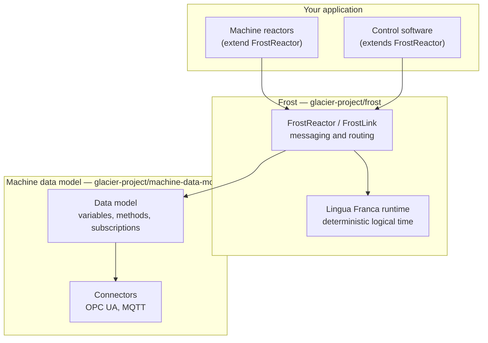
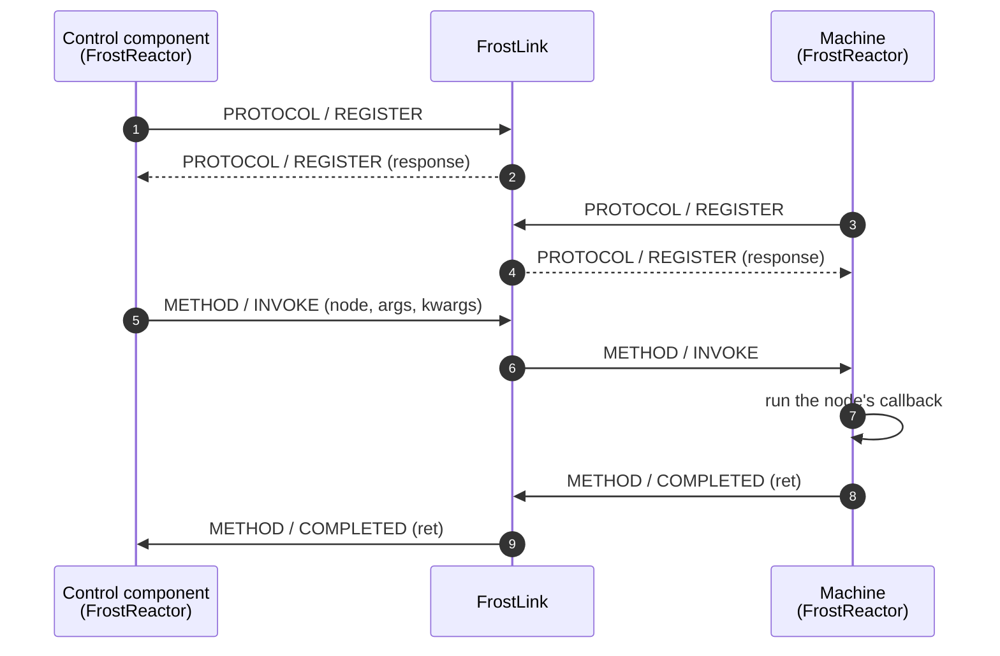

# Architecture

A GLACIER system is built from three layers. Each one is a separate library, and
each is useful on its own.

## The data model

The [machine data model](https://github.com/glacier-project/machine-data-model)
is the interface layer. A model is a tree declared in YAML, whose nodes are
folders, variables and methods. Loading it produces an object you can read from,
write to, invoke and subscribe to.

The data model is a standalone Python library. It does not depend on Frost, and
it can be used to wrap an OPC UA server or an MQTT broker without any simulation
involved.

See [Frost › Data model](../frost/data-model/index.md).

## Frost

[Frost](https://github.com/glacier-project/frost) is a library of Lingua Franca
reactors. It takes a data model, wraps it in a component that can send and
receive messages, and gives you a network in which those components can find
each other and talk.

The two components you build with are:

| Component | Role |
| --- | --- |
| `FrostReactor` | The building block for everything active: a simulated machine, a scheduler, a monitoring application. It owns a data model and can exchange messages. |
| `FrostLink` | The message router. Components register with it and it forwards messages to the target named in each message. |

See [Frost › Components](../frost/components/index.md).

## Lingua Franca

Frost reactors are Lingua Franca reactors, so they inherit its execution model:
reactions are triggered by events carrying a logical timestamp, and the runtime
orders those events deterministically. Two runs of the same program over the
same inputs produce the same sequence of reactions.

This is what makes simulated scenarios reproducible, and it is the reason Frost
is built on Lingua Franca rather than on a general-purpose async framework.

## How a request travels

The sequence below shows a control component invoking a method on a machine
through a `FrostLink`. Every arrow is a `FrostMessage`.

Registration happens first: a component broadcasts a `REGISTER` request on every
output channel, and records which port each answer came back on. Once every port
has been accounted for, the component sets `connected` and can address messages
by name.

Messages carry a namespace (`PROTOCOL`, `VARIABLE`, `METHOD`) and a name within
it (`REGISTER`, `READ`, `WRITE`, `SUBSCRIBE`, `UPDATE`, `INVOKE`, `COMPLETED`,
…). See [FrostInterface](../frost/components/frost-interface.md) for how a
component dispatches on them.

## Direct connections

The `FrostLink` is not mandatory. A `FrostReactor` also discovers whatever is
wired directly to its channels, and delivers a message straight to a known
target when one exists — falling back to the link only for targets it has not
met. Small systems can therefore be wired point-to-point with no router at all.
